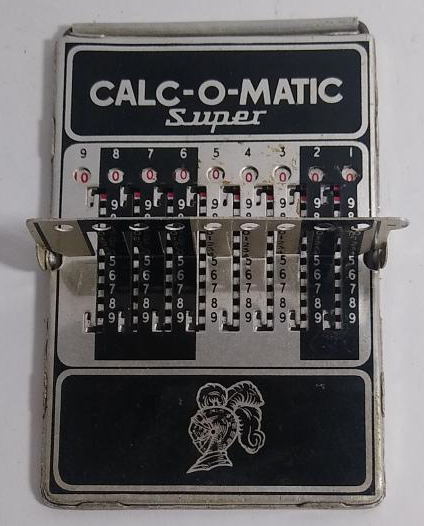
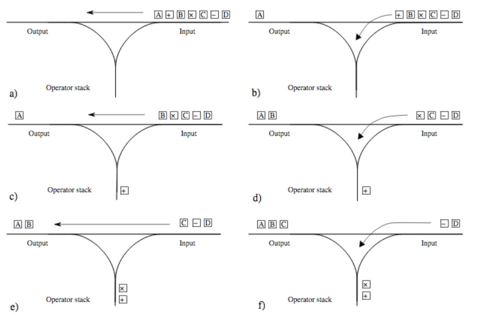

# calc-o-matic



**calc-o-matic** is a basic calculator based in [Shunting yard algorithm](https://en.wikipedia.org/wiki/Shunting_yard_algorithm)

## Usage

### Makefile targets

```shell
# build
make build

# test
make test

# clean
make clean

# generate coverage html report
make coverage

# generate docs
make docs
```

### calc-o-matic CLI

```shell
# write math expression
calc-o-matic /> 1+ 1 * (2/2) - 10^7

# cancel with Ctrl+C
calc-o-matic /> ^C
exiting calc-o-matic
```

## Shunting Yard algorithm


